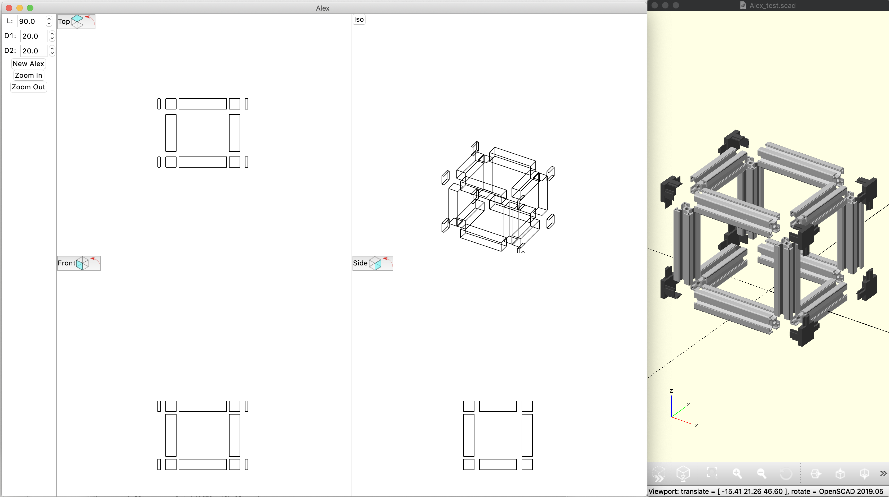

# Alex
Aluminium Extrusion specific CAD program
```
> pip install numpy-quaternion
> cd scripts
> python main_06.py &
> openscad Alex_test.scad ## or launch OpenScad manually, file->open "Alex_test.scad"
```


#TODO
- Get interfaces working
