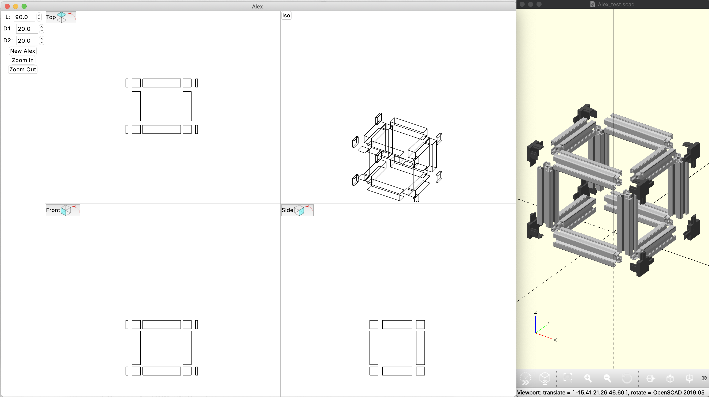

# Alex
Aluminium Extrusion specific CAD program for Python3
```
> pip install numpy-quaternion
> git clone git@github.com:wyolum/Alex.git
> cd Alex/scripts
> openscad Alex_test.scad & ### background this task or launch OpenScad manually, file->open "Alex_test.scad"
> python main_06.py
```

[](https://www.youtube.com/watch?v=mkjgiLznFwk)

## Shortcuts
* ctrl-n -- New Aluminum Extrusion
* ctrl-g -- Group selected items
* ctrl-u -- Ungroup selected group
* ctrl-d -- Duplicated selected items
* Del    -- Delete selected object



#TODO
- Get interfaces working
